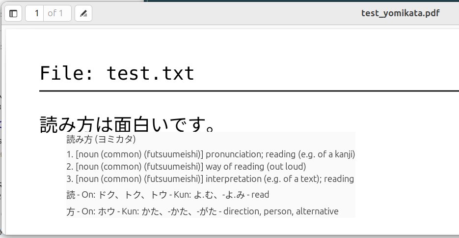

# YomiKata

Native Japanese hover dictionary for Ubuntu using the Linux Accessibility (AT-SPI) framework.

YomiKata is inspired by the [10ten Japanese Reader](https://github.com/birchill/10ten-ja-reader) browser
extension, but works with native desktop applications instead of a browser by reading accessible text
through AT-SPI.



## Status

Early development. See [PLAN.md](PLAN.md) for the project roadmap and architecture.

## Requirements

- Python 3.12+
- [uv](https://docs.astral.sh/uv/)
- System GObject-introspection bindings for AT-SPI, GTK4, and Libadwaita. On
  Ubuntu:

  ```bash
  sudo apt install python3-gi gir1.2-atspi-2.0 gir1.2-gtk-4.0 gir1.2-adw-1 at-spi2-core
  ```

  PyGObject is deliberately **not** a pip dependency: building it from source
  requires `pkg-config` and Cairo/GObject development headers, while Ubuntu
  already ships working prebuilt bindings. The project venv is created with
  `--system-site-packages` (see below) so it can see them.

  The popup window requires XWayland (present by default in a standard GNOME
  Wayland session). Native Wayland toplevels cannot be positioned by a
  client at an arbitrary screen coordinate -- only the compositor can place
  them -- so the popup forces the X11/XWayland GDK backend and positions
  itself as an X11 override-redirect window instead. See
  `src/yomikata/popup/window.py` for details.

## Development

```bash
uv venv --system-site-packages --python /usr/bin/python3.12
uv sync
uv run pytest
uv run ruff check .
uv run black --check .
uv run mypy src
```

### Running the app

The app needs a dictionary database before it will start; it refuses to run
without one (see `main()` in `src/yomikata/app.py`). Build one from the
public JMdict and KANJIDIC2 source files:

```bash
curl -o /tmp/JMdict_e.gz http://ftp.edrdg.org/pub/Nihongo/JMdict_e.gz
curl -o /tmp/kanjidic2.xml.gz http://ftp.edrdg.org/pub/Nihongo/kanjidic2.xml.gz
gunzip -k /tmp/JMdict_e.gz /tmp/kanjidic2.xml.gz

uv run python -c "
from pathlib import Path
from yomikata.dictionary.jmdict import build_dictionary_database
from yomikata.dictionary.kanjidic import build_kanji_database

db = Path('database/dictionary.sqlite3')
build_dictionary_database(Path('/tmp/JMdict_e'), db)
build_kanji_database(Path('/tmp/kanjidic2.xml'), db)
"
```

`build_dictionary_database` must run first -- it recreates the database file
from scratch. `build_kanji_database` then adds KANJIDIC2 data into the same
file without wiping it. This only needs to be done once; re-run it later to
pick up updated dictionary data.

Then run the app itself:

```bash
uv run yomikata
```

This starts the GLib main loop, polls the pointer every 30ms via AT-SPI, and
shows a popup when it settles over Japanese text in a supported application
(see PLAN.md's Scope section). Stop it with Ctrl+C.

### Wayland sessions (the Ubuntu/GNOME default)

YomiKata itself runs fine in a Wayland session, but it can only read text
from applications running under **XWayland**. A native Wayland client never
learns where the compositor placed its window, so it reports accessible
coordinates relative to its own surface; hit-testing those against the
global pointer position can never match, and hovering silently does
nothing.

Launch target applications with the X11 backend instead:

```bash
GDK_BACKEND=x11 evince file.pdf
GDK_BACKEND=x11 gedit notes.txt
```

A shell alias makes this painless for apps you launch from a terminal, but it
won't cover apps launched from the dock, Activities search, or a file
manager double-click. For those, set the backend for your whole GNOME
session instead:

```bash
mkdir -p ~/.config/environment.d
echo 'GDK_BACKEND=x11' >> ~/.config/environment.d/gdk-backend.conf
```

`environment.d` is read by `systemd --user` when it starts your session, so
this takes effect the next time you log in -- log out and back in (a full
reboot isn't necessary). It applies to every GTK app you launch afterward,
however you launch it. The trade-off is session-wide: all GTK apps run
under XWayland, not just the ones you hover over, so you lose Wayland-only
behavior (e.g. fractional scaling smoothness) everywhere, not just in your
target app.

In practice this can read as a general slowdown, not just a cosmetic loss:
XWayland's compatibility layer adds overhead versus native Wayland, so GNOME
Shell and every GTK app you launch -- not just target apps -- can feel less
responsive for as long as the file is in place. Prefer the per-app alias
above; reserve the session-wide `environment.d` file for active testing and
remove it again afterward. There is no way to undo it without logging out
again either: `environment.d` is only read when `systemd --user` (and
therefore GNOME Shell) starts, so `systemctl --user unset-environment
GDK_BACKEND` only affects processes spawned fresh via systemd from that
point on -- it cannot retroactively change GNOME Shell's own environment or
anything already forked from it.

On Ubuntu 26.04+, GNOME dropped the "GNOME on Xorg" login option entirely
-- Wayland is the only GNOME session available, so `environment.d` (or the
per-app alias/env var above) is the only way to get a target app onto
XWayland; there is no longer a full-Xorg-session escape hatch.

YomiKata detects the situation for you: it logs an informational note at
startup when it finds itself in a Wayland session, and logs a warning
naming the offending window the first time you hover over an application
whose reported position reveals it is running as a native Wayland client.

Reading native-Wayland windows directly would require compositor
cooperation (e.g. a GNOME Shell extension exposing pointer and window
geometry); that is a possible future backend, not a current feature.

To use a database built somewhere else, set `YOMIKATA_DATABASE_PATH` instead
of relying on the default `database/dictionary.sqlite3`:

```bash
YOMIKATA_DATABASE_PATH=/path/to/dictionary.sqlite3 uv run yomikata
```

By default the popup only appears while Ctrl is held, so it doesn't pop up
over Japanese text any time the pointer drifts near it during normal desktop
use -- unlike a browser extension, this polls the pointer across every app,
not just a page you're actively reading. Set `YOMIKATA_HOVER_MODIFIER` to
`alt` or `shift` to use a different key, or to `none` to show the popup on
plain hover with no modifier:

```bash
YOMIKATA_HOVER_MODIFIER=none uv run yomikata
```

### Troubleshooting

**`dbind-WARNING **: AT-SPI: Error in GetItems ... AppArmor policy prevents
this sender ...`** on startup, naming unrelated apps (e.g. a snap-packaged
`snap-store`, `slack`, `simplenote`): harmless. AT-SPI populates its object
cache by asking every registered application for its accessible items;
snap-confined apps whose AppArmor profile doesn't grant the accessibility
interface reject that request, and `dbind` logs a warning for each one. This
is independent of YomiKata -- it happens for any AT-SPI client that runs a
real GLib main loop on a machine with such snaps installed, and does not
affect reading accessible text from other applications. It's safe to ignore.

After `uv run yomikata` prints "YomiKata ready", the process blocks in the
GLib main loop waiting for a hover -- there is no further output until you
actually hover over Japanese text in a supported application. That's the
expected idle state, not a hang.

**Hovering over a supported app does nothing**: check the following, all
verified empirically on GNOME 46/Wayland:

- GNOME accessibility must be on:
  `gsettings set org.gnome.desktop.interface toolkit-accessibility true`.
  Apps that were already running when it was turned on never register with
  AT-SPI -- restart them.
- The target application must run under XWayland, not native Wayland
  (`GDK_BACKEND=x11` for GTK apps) -- see the "Wayland sessions" section
  above. YomiKata logs a warning naming the window when it detects this
  case, so check its output first. This mirrors the XWayland requirement
  the popup and pointer source already have.
- GTK4 applications (e.g. GNOME Text Editor, which is *not* gedit) do not
  work at all, even under XWayland: GTK4's accessibility bridge does not
  implement the coordinate-based text queries
  (`Text.get_offset_at_point`, `Text.get_character_extents`) this project
  depends on. Use the GTK3/ATK-era apps from PLAN.md's supported list --
  gedit, Evince, LibreOffice.
- LibreOffice needs its GTK3 integration for accessibility to exist at
  all: `sudo apt install libreoffice-gtk3`. Without it LibreOffice falls
  back to its bare X11 backend, which never registers with AT-SPI.

`YOMIKATA_HOVER_MODIFIER` (see above) also only detects the held key while
an XWayland window has focus -- another consequence of the same Wayland
design; keyboard state is invisible to X11 clients while a native-Wayland
window is focused. With the target app itself running under XWayland this
is automatically satisfied.
